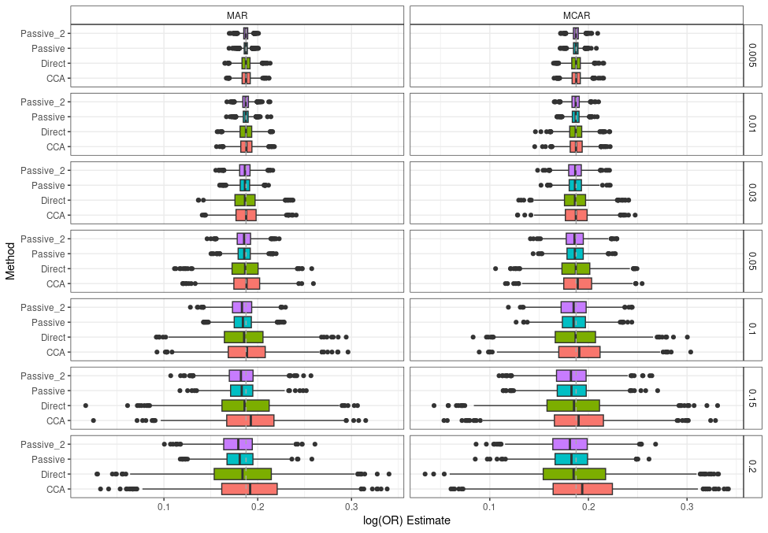
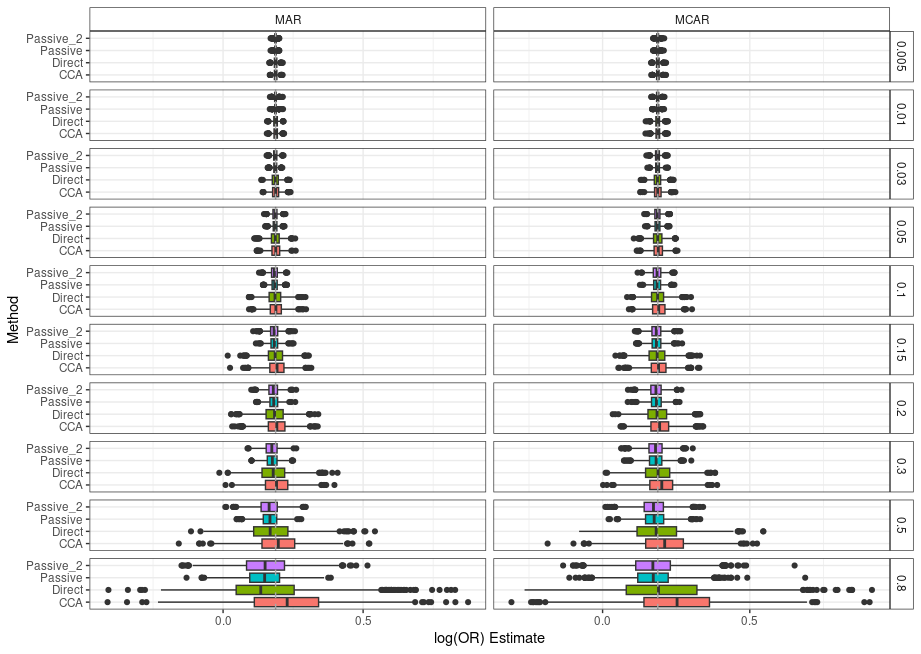

# STRIVE_Impute_Sim
This simulation evaluates imputation strategies for the primary endpoint of two ongoing STRIVE (Strategies and Treatments for Respiratory Infections and Viral Emergencies) platform clinical trials, whose aim is to improve patient health for those hospitalized with upper respiratory infections.

STRIVE (Strategies and Treatments for Respiratory Infections & Viral Emergencies; INSIGHT 018) aims to provide an agile research platform able to investigate strategies and treatments that may improve the health of patients hospitalized with a respiratory infection. The primary endpoint for two on-going STRIVE trials (NCT05605093 & NCT05822583) is the DRS-60, which is an ordinal composite endpoint reflecting the day of recovery and vital status through day 60. The DRS-60 will take on one of the following 63 values:

0 = returned out of the hospital on the day of randomization (day 0) and stayed out of the hospital through day 60
1 = left the hospital on day 1 and stayed out of the hospital through day 60
…
60 = out of the hospital on day 60
61 = alive but in the hospital on day 60
62 = dead on day 60

As with any randomized trial, there will inevitably be persons for whom we do not have complete follow-up data, and ultimately an unknown DRS-60 value.  This project evaluates ways of imputing the missing DRS-60 values.

Imputation Methods:
- Directly impute DRS-60 and evaluate using using a proportional odds model.
- Passively impute DRS-60 by imputing the daily status variables on days 0 to 60 (i.e., in hospital, out of hospital, and dead) with an indicator of being out of the hospital for 7 days, and evaluate using proportional odds model with results pooled across imputations.

Missingness Types:
- MCAR
- MAR

Data: 

The adapted data from the publicly available dataset from the ACTIV-3–TICO (Accelerating COVID-19 Therapeutic Interventions and Vaccines–Therapeutics for Inpatients with COVID-19) platform trial used in this study contained 1417 participants who had a full or partial infusion of AZ or placebo.

To induce missingness at random in the dataset, we model the probability of individual i dropping out on day t as logit(pit)= Xi+ Hit+ t, where Xi are the baseline covariates age and vaccination status, Hit are time-varying covariates indicating an individual’s current location and their total time spent at out of the hospital up until that point, and t = -0.5t + b is a baseline time-dependent function with b calibrated to reach the desired proportion of missingness in the outcome in expectation. For missing completely at random (MCAR) scenarios, we set = = 0. We assume all missingness is drop-out missingness—that is, an individual drops out on a particular day of data collection and all subsequent data for that individual are missing. Once pit is calculated for each individual, we simulate drop out for each individual on each of days 1 to 60 and induce missingness in all outcome data for the individual on and after their day of drop out, if any. If a simulated day of drop out is after the day an individual died, no missingness is added, which results in an overall proportion of missingness that is slightly lower than the targeted value.

To each simulated dataset, we apply the two imputation approaches and fit a proportional odds model. In addition, we perform a complete case analysis, dropping patients with simulated missingness. From the fit models, we obtain the point estimate and 95% CI for the odds ratio as well as the p-value testing the odds ratio is not 1. For each combination of missing data mechanism and target proportion missing, we simulate 1,000 replicates. For comparison, we also obtain the odds ratio estimate from the complete TICO dataset without inducing missingness; we treat this “gold standard” value as the truth in error metrics. To compare methods, we measure (1) the mean squared error (MSE) of the odds ratio estimate compared with the estimate from the gold standard analysis, (2) the coverage probability, and (3) the rejection rate, or proportion of simulations in which the p-value is less than .05.

Results:

Low Missingness:

High Missingness:
